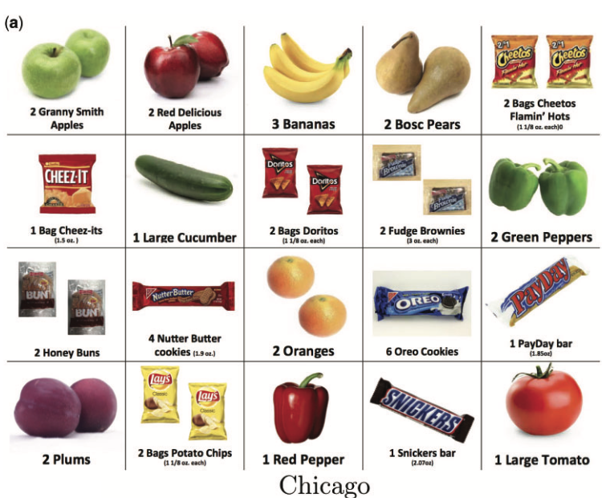

```{r setup, include=FALSE}
knitr::opts_chunk$set(echo = TRUE)
knitr::opts_chunk$set(cache = TRUE)
library(pacman)
```

---
#Summary

Field experiment: home grocery delivery program

Experimenters offer temptation foods at time of delivery in exchange for purchased foods

Findings imply that 40% are dynamically inconsistent

Individuals who are inconsistent are the least likely to use commitment device

---
#Introduction

Temptation and self control models are hot in behavioral economics

Dynamic inconsistencies pose issues: individuals want to go to the gym, but never want to go when asked

This paper aims to address a core question: 

### What is the relationship between dynamically inconsistent behaviour and beliefs thereof? 

In other words: Are inconsistent individuals blind to their faults? 

---
#Introduction

Previous literature finds positive to zero correlation between self control problems and awareness

Suggests that those with self control problems should be aware of their problem

Caveat: all of these findings comes from lab experiments (may have experimental bias)

---

#Aside

Commitment Demand = choosing to restrict oneself to the advance bundle

Advance bundle = bundle pre-ordered

Immediate bundle = bundle with temptation goods

---
#Findings

46% of individuals are dynamically inconsistent when commitment is not available

Regularly individuals substitute fruits and veggies for caloric-dense and high fat foods

When commitment is available, 53% of individuals take it up

- Subjects who are dynamically inconsistent are the least likely to take up commitment (44%)

- Subjects who are dynamically consistent are more likely to take up commitment (60%)

Suggests that those with dynamic inconsistent behavior may be the least aware of their behavior

---

#Implications

How should we measure welfare in these situations?

- Utilizing "long run" preferences without temptations?

- Utilizing "short run" preferences with temptations?

- Utilizing unambiguous preferences? (preferences that are consistent across short and long run)

---

#Experimental Setup

Two experiments used (one for findings and one for replication of findings)

---

#Experimental Setup: Chicago

Subjects were not told they were apart of an experiment

20 foods were offered in the experiment for home delivery


---

{width=300}


---
#Experimental


